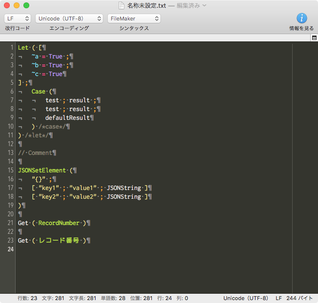

filemaker-syntax-coteditor
================

FileMaker CotEditor Syntax Highlighting

使い方
===============

クローン
-----

    mkdir folder
    cd folder/
    git clone https://github.com/frudens/filemaker-syntax-coteditor.git

インポート
-----

CotEditor > 環境設定 > フォーマット > インストール済みスタイル > 読み込み… > `FileMaker.yaml`を選択

イメージ
-----

Contact
=======

Teruhiro Komaki

komaki at frudens.jp